<p align="center">
  <a href="https://mcxiaocaibug.github.io/">
    
  </a>
</p>

<p align="center">
  <a href="https://github.com/Mcxiaocaibug/Mcxiaocaibug.github.io/actions/workflows/deploy-pages.yml"></a>
  <a href="https://mcxiaocaibug.github.io/"></a>
  <a href="https://github.com/subframe7536/maple-font"></a>
</p>

# Mcxiaocaibug.github.io

**写代码，也写风与月。** 从宇宙首屏，到滚动叙事，再到持续更新的工作现场。

[进入星空 →](https://mcxiaocaibug.github.io/) · [查看部署 →](https://github.com/Mcxiaocaibug/Mcxiaocaibug.github.io/actions/workflows/deploy-pages.yml)

## 让每一次创造，都有回响

[](https://mcxiaocaibug.github.io/#activity-title)

- **网站工作流面板**：直接读取 GitHub Actions 最近 3 次运行。运行中每 60 秒、空闲每 5 分钟更新；仅在面板进入视口且标签页可见时轮询。
- **公开活动流**：每 5 分钟读取最新提交、PR、发布和新仓库。GitHub Events 本身可能有延迟，因此不是秒级推送。
- **降级明确**：断网、API 限流或超时保留上次数据，标明快照与核对时间；恢复后自动重试，限流遵循 API 返回的重置时间。
- **README**：顶图是原生 SVG 星空与轨道动画；徽章由 GitHub 提供部署状态，遥测卡片是每次构建生成的时间戳快照。GitHub 图片代理可能缓存，点击可查看源状态。
- **静态可用**：无 JavaScript 仍有构建快照与链接。浏览器不携带 Token，授权仅用于 Actions 构建过程，数据不会写回仓库触发循环提交。

## 自动化航线

```text
push main / 每小时 :23 / 手动触发
                  ↓
      npm ci → 同步 GitHub 公开数据
                  ↓
      生成 Maple Mono SVG / 社交封面
                  ↓
      类型检查 → 单元测试 → 静态构建
                  ↓
          发布到 GitHub Pages
```

Pull Request 只做构建与检查，不部署。API 暂时不可用时保留旧快照，不阻塞站点发布。

## 视觉与动效

- 原生 Canvas 星空穿梭、程序化月面、卫星轨道与指针视差，无第三方动画库或外部场景图片请求。
- 原生滚动驱动的「灵感 → 构建 → 抵达」叙事，不接管滚轮，也不拦截触摸滚动。
- 四组 CSS 项目概念视觉，配合悬停倾斜、光斑与箭头反馈；不是项目实机截图。
- 星空冷蓝、月光白、薄荷色信号延续到工作流面板、README 顶图及 Open Graph 分享封面。
- 首屏支持暂停/恢复动效；动画响应 `prefers-reduced-motion`。README SVG 在支持该媒体查询的客户端也会静止。
- 窗口高度不足 680px 自动采用非固定叙事布局；星空离开视口或标签页隐藏时暂停，Canvas 像素比上限 1.6。

## Maple Mono，贯穿始终

全站正文、标题、代码及状态面板使用本地 [Maple Mono CN v7.9](https://github.com/subframe7536/maple-font/releases/tag/v7.9)，提供 Regular / SemiBold 两个 WOFF2 子集，保留连字，Regular 预加载，`font-display: swap` 避免阻塞文本。

- 子集覆盖当前页面中文、拉丁字符与界面符号；实时 GitHub 内容中的额外字符使用系统中文字体兜底。
- README 图形文字转换为 Maple Mono 的 SVG 路径，在 GitHub 图片环境中也保留字形，无需远程字体。
- 字体遵循 SIL Open Font License，见 [`static/fonts/LICENSE.txt`](static/fonts/LICENSE.txt)。
- 新增页面文字后，可从官方发行包取得 TTF 并重新生成子集：

```bash
python3 -m pip install -r scripts/requirements-visuals.txt
python3 scripts/build-visuals.py --font-source /path/to/MapleMono-CN-unhinted
node scripts/render-social.mjs
```

## 本地运行与验证

需要 Node.js 22.13+。Svelte 5 + SvelteKit / adapter-static + TypeScript。

```bash
npm ci
npm run dev

npm run check       # Svelte / TypeScript
npm run test:unit   # 动效数学、GitHub 数据、状态与异常
npm test            # 单元测试 + 正式静态构建
npm run preview
```

生成与更新资产（普通构建不需要 Python）：

```bash
npm run update:recent-work   # GH_TOKEN 可选；不配置则使用公开 API
python3 -m pip install -r scripts/requirements-visuals.txt
npm run build:visuals       # SVG 顶图、快照卡片、1280×640 社交封面
```

SVG 由确定性向量代码生成，未使用外部位图或远程字体。静态构建输出到 `build/`，自动化工作流见 [`.github/workflows/deploy-pages.yml`](.github/workflows/deploy-pages.yml)。
